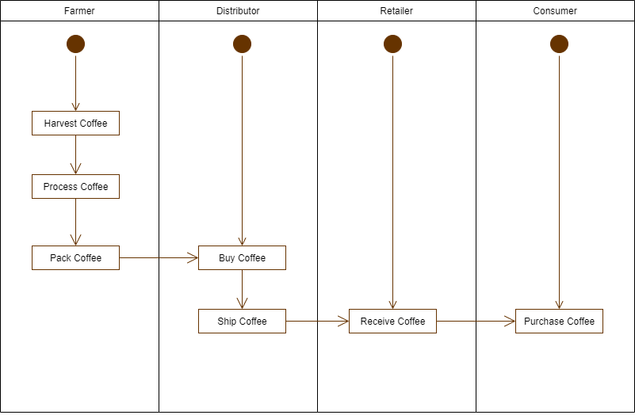
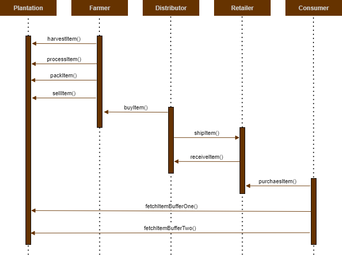
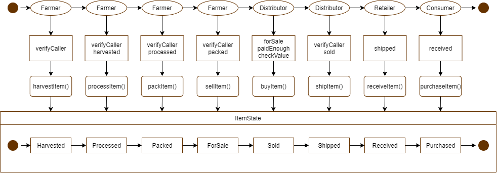
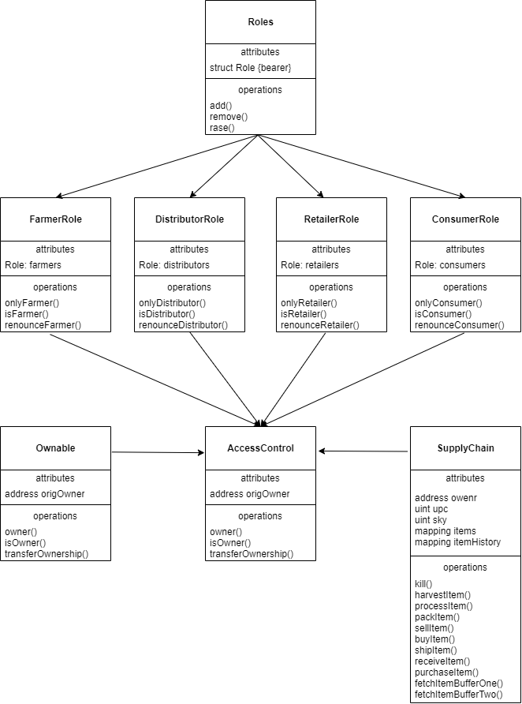

# Ethereum DApp for Tracking Items

## Diagrams

### Activity Diagram



### Sequence Diagram



### State Diagram



### Classes (Data Model)



## Libraries

For the inplementation I rely on 

- Truffle (version 4.1.14) 

as a development environment to support the migration and testing of the code after having too many issues with a current version of truffle. The pother versions are 

- Web3 (version 6.14.8)
- Node (version 14.15.1)

## General Write-Up

For the implementation I started in with the roles contracts and added the missing content following the structure of `FarmerRole.sol`. As the next step I added the missing content in `SupplyChain.sol`, `Ownable.sol` should have been complete according to the instructions. Then finished the tests of the code on `TestSupplyChain.js`. Here I started at the end with the two last tests and then went through the supply chain, adapting the content of the two last tests to the test I was currently working on so that these test never failed. Finally I adapted the front-end and deployed it to check it.

## Rinkeby Deployment

To deploy the network I used:

```zsh
> truffle migrate --reset --network rinkeby
Compiling .\contracts\coffeeaccesscontrol\ConsumerRole.sol...
Compiling .\contracts\coffeeaccesscontrol\DistributorRole.sol...
Compiling .\contracts\coffeeaccesscontrol\RetailerRole.sol...
Compiling .\contracts\coffeebase\SupplyChain.sol...
Compiling .\contracts\Migrations.sol...
Compiling .\contracts\coffeeaccesscontrol\ConsumerRole.sol...
Compiling .\contracts\coffeeaccesscontrol\DistributorRole.sol...
Compiling .\contracts\coffeeaccesscontrol\FarmerRole.sol...
Compiling .\contracts\coffeeaccesscontrol\RetailerRole.sol...
Compiling .\contracts\coffeeaccesscontrol\Roles.sol...
Compiling .\contracts\coffeebase\SupplyChain.sol...
Compiling .\contracts\coffeecore\Ownable.sol...
Writing artifacts to .\build\contracts

Using network 'rinkeby'.

Running migration: 1_initial_migration.js
  Deploying Migrations...
  ... 0xca2bc3f0e69667f17feb7423ce7d780b2dcdc2a517c774b51ef76815bc31e779
  Migrations: 0x99732f8a40d2e0041b33bd254bbd027832cff0f2
Saving successful migration to network...
  ... 0xfe6192d362980dbc9468608bb614e12ead1f24dabd0f466d851d1087bcf91623
Saving artifacts...
Running migration: 2_deploy_contracts.js
  Deploying FarmerRole...
  ... 0x6c88b93b40adf7408e19d782c2d4293a2dfe439dba35834160f5eae32717825b
  FarmerRole: 0x4da299ed39db8689e2bab7b52667798a76bc2ba4
  Deploying DistributorRole...
  ... 0x6522c7425c922699133bfa891ddb155082153fb99801444b1275a51df8d57a9d
  DistributorRole: 0xe555a00bc8506f1c441f5c0462a1c9c1b7cb746a
  Deploying RetailerRole...
  ... 0x14f04a429de72619b052b29a55e54fec457dd05d8c4b9d98311917234611dc83
  RetailerRole: 0x62e1602ec23f74ffce79265564c69110dc47de40
  Deploying ConsumerRole...
  ... 0xcc9e20fdfde931fca43e3d98ca13dee3ef8fb9794722ac5c6fcfdd66048652ee
  ConsumerRole: 0x9b5a012090cc2538f7fdfa3d8a542676908a2967
  Deploying SupplyChain...
  ... 0x3c6f67ba58c970f3a7135b4901ab427cc748d7b9d34803230b24680057101204
  SupplyChain: 0x336c2cd967cd6de4ad22776bbcd6a16624a8e550
Saving successful migration to network...
  ... 0xb1b03cd58c76cc74c8c1c4a27e80a2dcfe0e04510202059b4efb9498823b4ee2
Saving artifacts...
```

### Addresses:

FarmerRole:

- 0x4da299ed39db8689e2bab7b52667798a76bc2ba4

DistributorRole:

- 0xe555a00bc8506f1c441f5c0462a1c9c1b7cb746a

RetailerRole:

- 0x62e1602ec23f74ffce79265564c69110dc47de40

ConsumerRole:

- 0x9b5a012090cc2538f7fdfa3d8a542676908a2967

SupplyChain:

- 0x336c2cd967cd6de4ad22776bbcd6a16624a8e550

